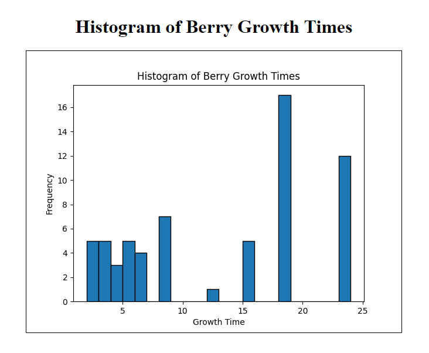

# Running the Poke Berries Stats API

This document provides instructions on how to set up and run the Poke Berries Stats API project.

## Setting Up the Virtual Environment

**Important**: This project works with Python version >= 3.10

1. **Open a Terminal**: Navigate to the root directory of the project.

2. **Create a Virtual Environment**: Run the following command to create a virtual environment named `.venv`. This isolates the project's dependencies from other Python projects on your system.

   ```bash
   python3 -m venv .venv
   ```

3. **Activate the Virtual Environment**: Before installing dependencies or running the application, activate the virtual environment.

   - On Linux or macOS:

     ```bash
     source .venv/bin/activate
     ```

   - On Windows:

     ```bash
     .\.venv\Scripts\activate
     ```

## Installing Dependencies

With the virtual environment activated, install the project's dependencies using `pip`.

```bash
pip3 install -r requirements.txt
```

This command installs all the necessary packages listed in the `requirements.txt` file.

## Running the Flask Application

1. **Set Environment Variables**: If your application requires environment variables.

   ```bash
   export FLASK_APP=app/app.py && export FLASK_ENV=development
   ```

2. **Run the Flask Application**: Use the `flask run` command to start the application.

   ```bash
   flask run
   ```

   This command starts the Flask development server. You should see output indicating the server is running, along with the address and port (usually `http://127.0.0.1:5000/`).

## Accessing the API Endpoints

Once the Flask application is running, you can access the API endpoints using a web browser or a tool like `curl` or Postman.

### GET `/api/v1/allBerryStats/`

This endpoint retrieves statistics about Poke Berries. The response will be in JSON format this is a example of the response:

```json
// Response
{
   "berries_names": [...],
   "min_growth_time": "", // time, int
   "median_growth_time": "", // time, float
   "max_growth_time": "", // time, int
   "variance_growth_time": "", // time, float
   "mean_growth_time": "", // time, float
   "frequency_growth_time": "", // time, {growth_time: frequency, ...}
}
```

To access this endpoint, navigate to `http://127.0.0.1:5000/api/v1/allBerryStats/` in your web browser or use a tool like `curl` with the command:

```bash
curl http://127.0.0.1:5000/api/v1/allBerryStats/
```

### View `/api/v1/allBerryStats/histogram`

This view is a histogram graph with statistics on berry growth times.



To access this view, navigate to `http://127.0.0.1:5000/api/v1/allBerryStats/histogram` in your web browser.

## Testing with Pytest

To run tests with pytest, ensure you have pytest installed in your virtual environment:

```bash
pip install pytest
```

Then, run the tests with the following command:

```bash
pytest
```
This command will discover and run all tests in the project.

---

# Running the Poke Berries Stats API using the Dockerfile

This document provides instructions on how to build and run the Poke Berries Stats API project using Docker.

## Prerequisites

- Docker installed on your machine. If you haven't installed Docker yet, you can download it from the [official Docker website](https://www.docker.com/products/docker-desktop).
- A terminal or command prompt.


## Building the Docker Image

1. **Open a Terminal**: Navigate to the root directory of the project where the Dockerfile is located.

2. **Build the Docker Image**: Run the following command to build a Docker image for the Poke Berries Stats API. Replace `dockerfile` with a name of your choice for the Docker image.

   ```bash
   docker build -t dockerfile .
   ```

   This command tells Docker to build an image using the Dockerfile in the current directory (`.`) and tag it with the name `dockerfile`.

## Running the Docker Container

1. **Run the Docker Container**: After building the image, you can run a container from it using the following command. Replace `dockerfile` with the name you used when building the image, and `berries_api` with a name for your container.

   ```bash
   docker run -d -p 5000:5000 --name berries_api dockerfile
   ```

   This command tells Docker to run a container in detached mode (`-d`), map port 5000 of the container to port 5000 of the host (`-p 5000:5000`), name the container `berries_api`, and use the image `dockerfile`.

2. **Access the API**: Once the container is running, you can access the Poke Berries Stats API by navigating to `http://localhost:5000/api/v1/allBerryStats/` in your web browser or using a tool like `curl` with the command:

   ```bash
   curl http://localhost:5000/api/v1/allBerryStats/
   ```

## Stopping and Removing the Docker Container

If you need to stop the running container, you can do so with the following command:

```bash
docker stop berries_api
```

And if you want to remove the container after stopping it, use:

```bash
docker rm berries_api
```

<!-- TODO: Explicar porque utiliza flask cache y no Redis -->
